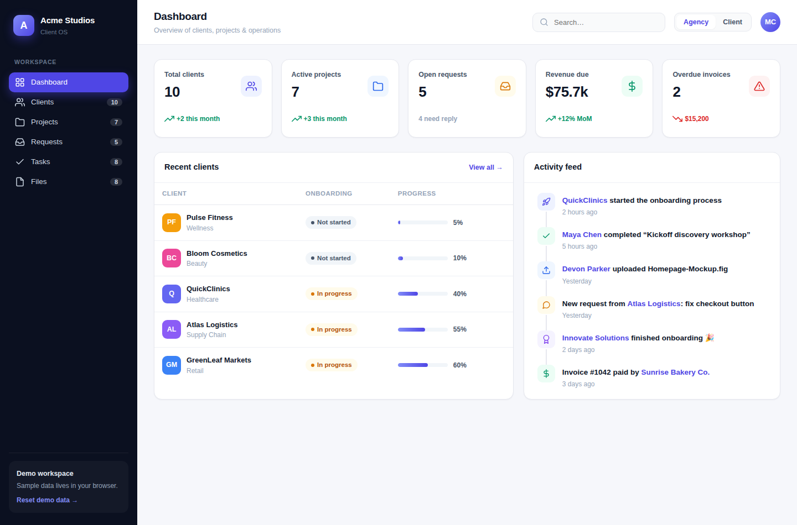

# Acme Studios — Customer Onboarding Dashboard

A complete customer onboarding dashboard for a digital agency, built as a
self-contained web app. Manage clients, track projects, monitor onboarding
progress, handle client requests, assign tasks, and organize files — all in
one place, with **no build step and no dependencies**.

Just open `index.html` in a browser.



## Features

- **Two roles, one workspace** — toggle between the **Agency** view (all
  clients and operations) and the **Client** view (a single client's own
  projects, requests, files, and onboarding checklist).
- **Agency dashboard** — KPI cards for total clients, active projects, open
  requests, revenue due, and overdue invoices, plus a recent-clients table and
  a live activity feed.
- **Client dashboard** — a personalized welcome banner, scoped KPIs, the
  client's projects, and a step-by-step onboarding checklist.
- **Clients** — a sortable roster with industry, onboarding status, progress,
  project count, and monthly value. Add new clients from a modal form.
- **Projects** — cards showing status, priority, progress bar, timeline,
  budget, and the assigned lead. Create projects with full detail.
- **Requests** — client change-requests with priority and status, filterable
  by client in the client view.
- **Tasks** — grouped by project with one-click completion toggles that
  persist.
- **Files** — a shared asset library with type-coded icons.
- **Persistence** — all data (including your edits) is saved to the browser's
  `localStorage`. Use **Reset demo data** in the sidebar to restore the
  original sample set.

## Running it

No tooling required:

```bash
# Option 1 — open the file directly
open index.html            # macOS
xdg-open index.html        # Linux

# Option 2 — serve it (nicer URLs, avoids file:// quirks)
python3 -m http.server 8000
# then visit http://localhost:8000
```

## Project structure

```
index.html            # App shell (sidebar, topbar, mount points)
assets/
  css/styles.css      # Design tokens + all component styles
  js/
    icons.js          # Inline SVG icon set (no icon-font dependency)
    seed.js           # Realistic sample data for Acme Studios
    app.js            # Store, views, modals, and interactions
```

## How it works

`app.js` is a small vanilla-JS SPA. A `Store` object holds all data and syncs
it to `localStorage`. Each screen is a function on the `Views` object that
returns an HTML string; navigation, role switching, the client picker, task
toggles, and the "add" modal forms all re-render from that single source of
truth. Adding a new field or screen means editing the seed data and one view
function — no framework, no bundler.

## Notes

This started as an experiment in recreating, as real code, the kind of
onboarding system you might assemble on a no-code platform from a single
prompt — dashboards, records, roles, and forms in one place. The data is
sample data for a fictional agency ("Acme Studios") and lives entirely in your
browser.
